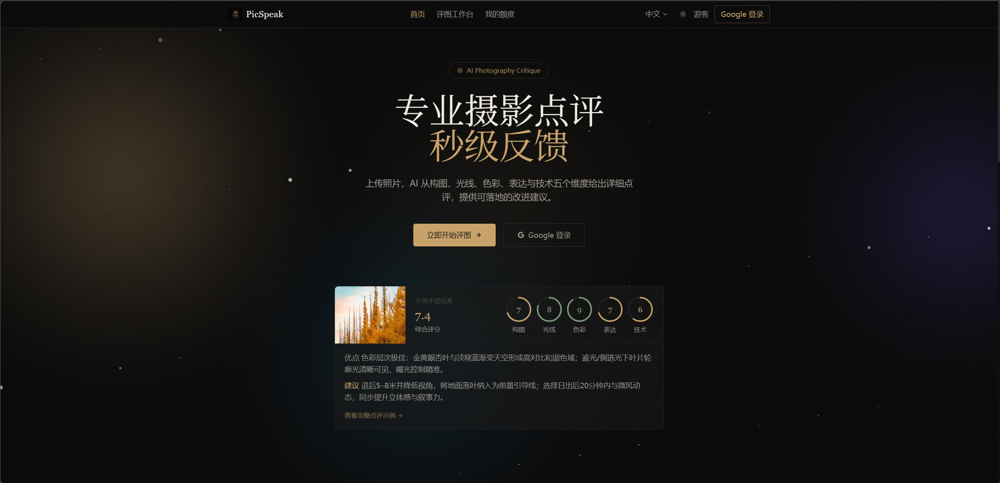
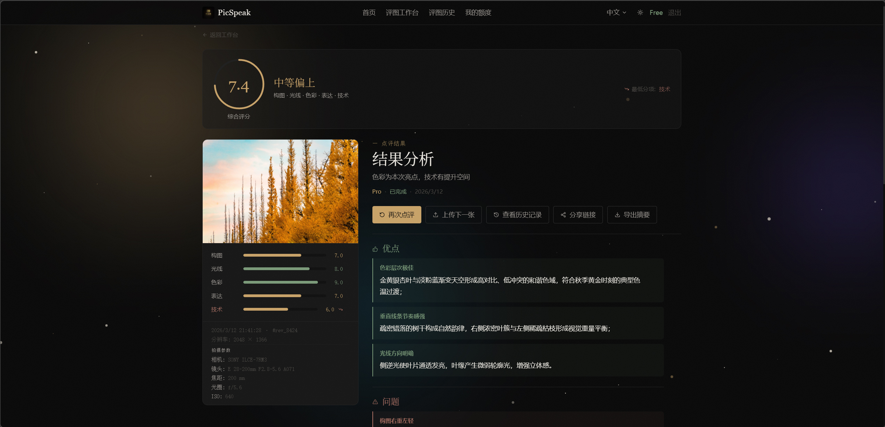
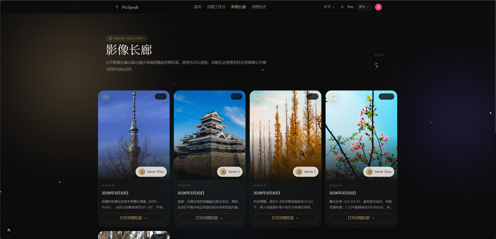
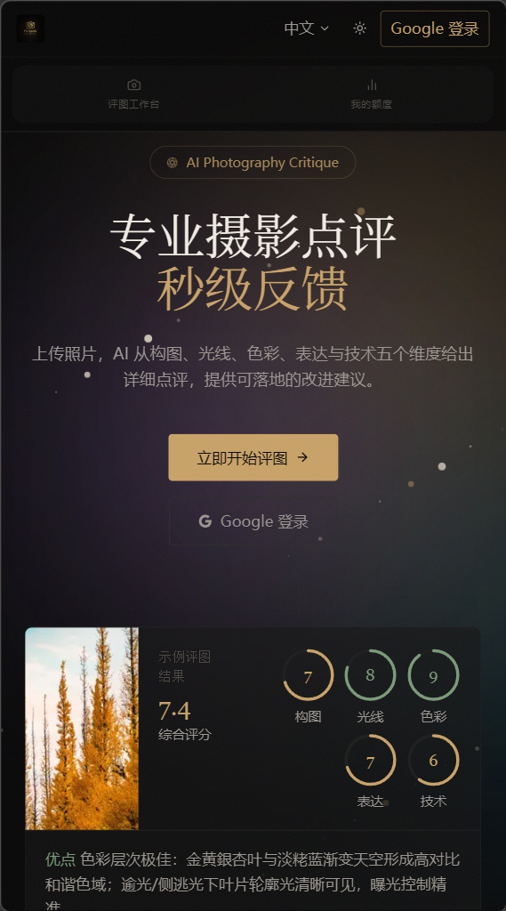

# PicSpeak

[English](README.md) | [简体中文](README.zh-CN.md)

[](https://nextjs.org/)
[](https://www.python.org/)
[](LICENSE)

**PicSpeak** is an AI-powered web application for photography critique. Upload a photo and receive professional AI feedback on composition, lighting, and color within seconds. No registration is required. You can start immediately as a guest.

---

## Screenshots

| Home | Review Result |
|------|---------------|
|  |  |

| Gallery | Mobile |
|---------|--------|
|  |  |

---

## Features

- `Guest Mode` — Start using the app instantly without registration
- `Google Sign-In` — One-click authorization for higher usage limits
- `Direct Image Upload` — Upload files directly from the frontend to object storage without routing through the backend
- `AI Critique by Category` — Receive scoring and suggestions across composition, lighting, color, emotional impact, and technical execution for different types of photography, with both lightweight (`Flash`) and in-depth (`Pro`) modes
- `AI Create` — Generate visual references from templates, prompts, quality, ratio, and style controls using an OpenAI-compatible image generation API
- `Retake References` — Turn critique suggestions into AI-generated composition, lighting, color, or retake reference images from a review
- `Generation History` — Browse generated images, download results, copy prompts, generate again, or send an image back to the workspace as retake inspiration
- `Image Generation Credits` — Track monthly generation credits, redeem promo credits, and purchase extra credit packs
- `Usage Quotas` — Daily and monthly limits with separate tracking for guests and registered users
- `Review History` — Browse all past critiques with pagination and filters for time range, score range, and image type
- `Real-Time Updates` — Subscribe to task progress through WebSocket without manual refresh
- `Sharing and Export` — Generate share links or export structured review data for reuse
- `Re-analysis` — Re-run analysis on a previous photo or upload a new one for another critique
- `Favorites` — Save preferred critique results and manage them from a dedicated favorites page
- `Gallery` — Showcase selected outstanding works from the community
- `Blog` — Access professional photography tutorials, AI analysis insights, and platform updates

## Tech Stack

| Layer | Technology |
|-------|------------|
| Frontend | Next.js 15 · React 18 · TypeScript · Tailwind CSS |
| Backend | Python 3.11 · FastAPI · SQLAlchemy 2.x |
| Database | PostgreSQL |
| Storage | S3-compatible object storage |

## Quick Start

### Prerequisites

- Python 3.10+
- Node.js 18+
- PostgreSQL 14+
- S3-compatible object storage such as Cloudflare R2 or MinIO
- An AI API key compatible with the OpenAI API format
- Optional: an OpenAI-compatible image generation endpoint and Lemon Squeezy checkout URLs for Pro and credit-pack billing

### 1. Clone the repository

```bash
git clone https://github.com/AsaZhou923/picspeak.git
cd picspeak
```

### 2. Initialize the database

```bash
psql "$DATABASE_URL" -f create_schema.sql
```

### 3. Configure the backend

```bash
cp backend/.env.example backend/.env
# Edit backend/.env and fill in the database, object storage, AI API,
# image generation, and billing settings as needed
```

### 4. Start the backend

```bash
python -m venv .venv
source .venv/bin/activate   # Windows: .venv\Scripts\activate
pip install -r backend/requirements.txt
uvicorn backend.app.main:app --reload --host 0.0.0.0 --port 8000
```

### 5. Configure and start the frontend

```bash
cp frontend/.env.example frontend/.env.local
# Edit frontend/.env.local and fill in NEXT_PUBLIC_API_URL and other settings

cd frontend
npm install
npm run dev
```

Open [http://localhost:3000](http://localhost:3000) in your browser.

## Deployment

Both the backend and frontend can be deployed in containers. The backend `Dockerfile` is already included in the `backend/` directory.

```bash
# Backend
uvicorn backend.app.main:app --host 0.0.0.0 --port 8000
python -m backend.app.worker_main   # Optional: run a separate worker process

# Frontend
cd frontend && npm run build && npm run start
```

## Documentation

- [Changelog](docs/changelog/update-log-2026-04-25-ai-image-generation-and-credits.md)
- [Backend API Documentation](docs/api/后端接口文档_v1.md)
- [System Architecture](docs/architecture/系统架构.md)
- [Google Sign-In Integration Guide](docs/guides/Google登录接入指南.md)

## Contributing

Issues and pull requests are welcome.

## License

[MIT](LICENSE)
