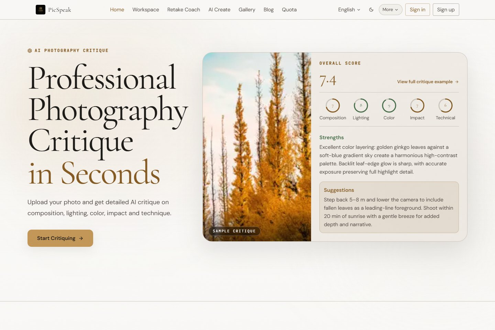
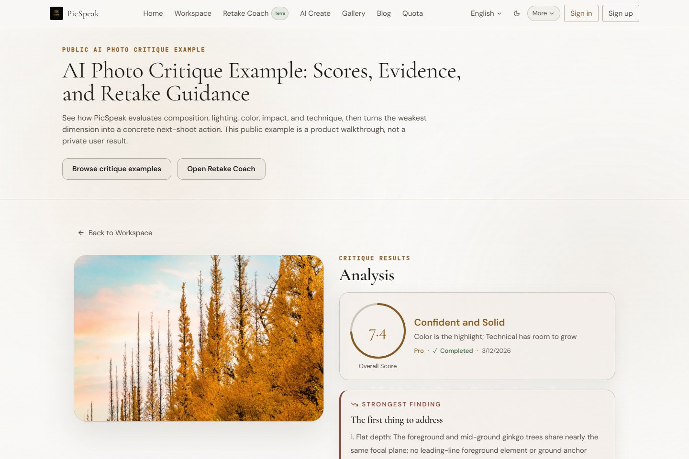
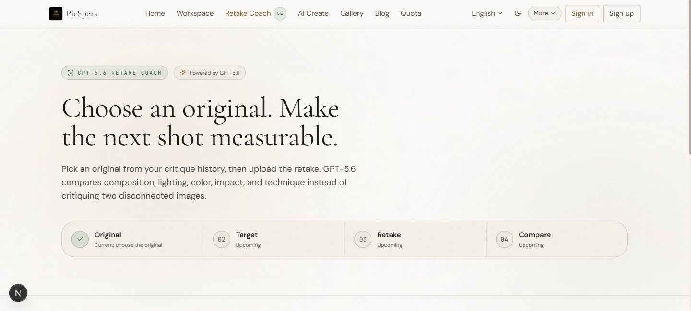
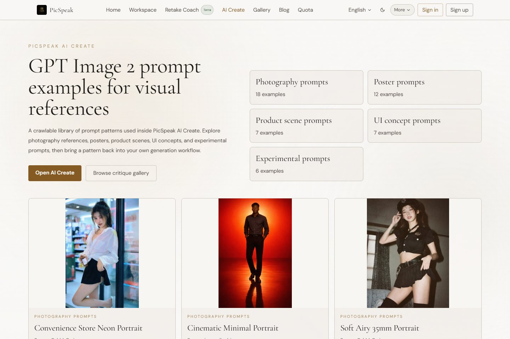
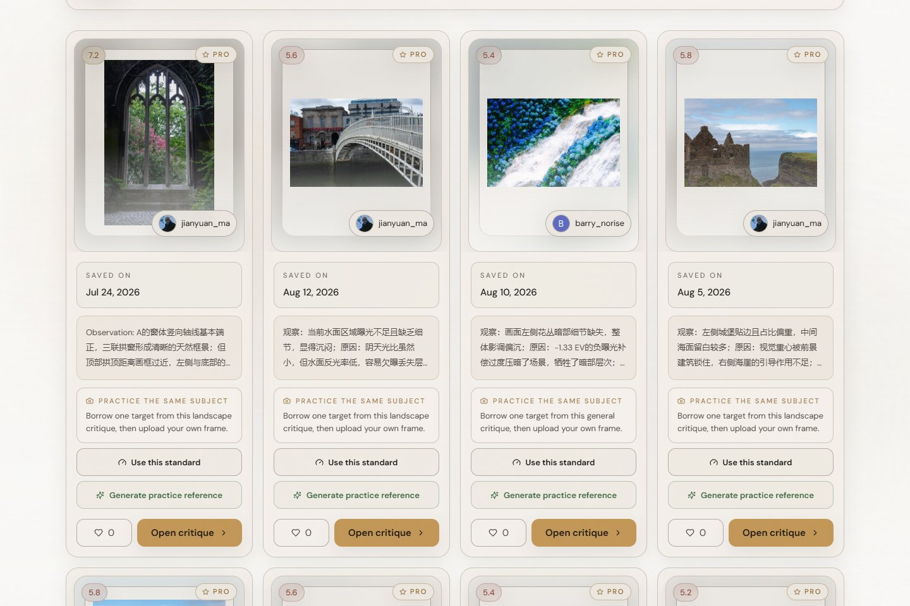
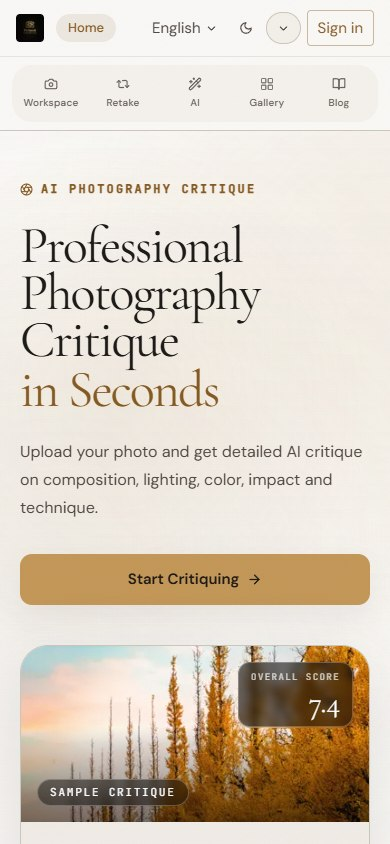

# PicSpeak

[English](README.md) | [简体中文](README.zh-CN.md)

[](https://github.com/AsaZhou923/picspeak/actions/workflows/ci.yml)
[](https://nextjs.org/)
[](https://www.python.org/)
[](LICENSE)

**把摄影点评真正变成下一次拍摄。** PicSpeak 从构图、光线、色彩、感染力和技术五个维度评分，解释画面证据，把最弱项转成可执行的复拍目标，并可继续生成 GPT Image 2 视觉参考。游客无需注册即可开始体验。

[在线体验](https://www.picspeak.art/zh) · [公开点评示例](https://www.picspeak.art/reviews/rev_8424d4fbde054759) · [复拍教练](https://www.picspeak.art/retake) · [提示词案例库](https://www.picspeak.art/generate/prompts) · [影像长廊](https://www.picspeak.art/gallery)



## 从一次点评到可衡量的练习

普通点评工具往往停在“描述这一张照片”。PicSpeak 会把建议持续带到下一次尝试：

```text
上传照片
  -> 五维评分与可见证据
  -> 下一次拍摄动作与成功条件
  -> 上传复拍照片
  -> 用同一把尺比较原片与复拍
  -> 保存进步，并生成下一轮视觉目标
```

- **单张照片点评：** 可选择兼容默认的 Qwen 路径，或通过 OpenAI Responses API 使用 `xhigh` 推理强度的 GPT-5.6 Luna。
- **复拍教练：** GPT-5.6 Luna 以 `xhigh` 推理强度在同一次请求中接收原片和复拍；所有分差均由服务端确定性计算。
- **AI 创作：** 使用 GPT Image 2 生成视觉参考，包括点评关联的构图、光线、色彩与复拍方向。
- **学习入口：** 在点评、公开长廊、镜头手记、提示词案例、点评历史和同源复拍链之间继续练习。

## 产品界面

| 公开点评 | GPT-5.6 复拍教练 |
|---|---|
|  |  |

| GPT Image 2 提示词案例库 | 公开点评长廊 |
|---|---|
|  |  |

<p align="center">
  
</p>

## 核心能力

| 领域 | 能力 |
|---|---|
| 摄影点评 | 游客模式、对象存储直传、Flash / Pro 深度、五维评分、结合 EXIF 的证据、分享、导出与再次分析 |
| 练习闭环 | 下一次拍摄清单、来源点评上下文、同图重跑、新图复拍、收藏与可筛选历史 |
| 复拍教练 | 原片 / 复拍配对评估、可比性与置信度处理、确定性分差、剩余问题、成功条件与进步链 |
| AI 创作 | 模板和提示词控制、质量与画幅选择、GPT Image 2 credits、点评关联参考图、下载、复用与生成历史 |
| 公开学习 | 50 个可抓取提示词案例、点评长廊、三语镜头手记、更新记录与服务端渲染的 SEO / GEO 内容 |
| 平台能力 | Clerk 登录、游客 / 用户额度、Lemon Squeezy 计费、WebSocket 任务更新、PostgreSQL 与 S3 兼容存储 |

## 公开入口

| 页面 | 地址 |
|---|---|
| 中文产品首页 | [picspeak.art/zh](https://www.picspeak.art/zh) |
| 公开点评导览 | [/reviews/rev_8424d4fbde054759](https://www.picspeak.art/reviews/rev_8424d4fbde054759) |
| 复拍教练 | [/retake](https://www.picspeak.art/retake) |
| GPT Image 2 提示词案例 | [/generate/prompts](https://www.picspeak.art/generate/prompts) |
| 点评长廊 | [/gallery](https://www.picspeak.art/gallery) |
| 镜头手记 | [/zh/blog](https://www.picspeak.art/zh/blog) |
| 产品更新 | [/zh/updates](https://www.picspeak.art/zh/updates) |

## 系统架构

```text
Next.js 15 / React 18
  -> 图片直传 S3 兼容对象存储
  -> FastAPI 点评与生图 API
  -> 内嵌或独立异步 worker
  -> Qwen 兼容点评 / OpenAI Responses / GPT Image 2
  -> PostgreSQL 点评、任务、计费与进步记录
```

| 层级 | 技术 |
|---|---|
| 前端 | Next.js 15 · React 18 · TypeScript · Tailwind CSS |
| 后端 | Python 3.11 · FastAPI · SQLAlchemy 2.x · Alembic |
| 数据库 | PostgreSQL |
| 存储 | S3 兼容对象存储，包括 Cloudflare R2 或 MinIO |
| 身份认证 | Clerk，以及游客会话和旧 Google OAuth 兼容路径 |
| 计费 | Lemon Squeezy 订阅、激活码与生图点数包 |

## OpenAI Build Week 2026

PicSpeak 在提交窗口前已经存在。Build Week 的贡献是在原有单张照片产品上建立可审计的复拍闭环，而不是只替换模型名称。活动前基线为 [`b74ddfb`](https://github.com/AsaZhou923/picspeak/commit/b74ddfb88ae32e37965ba8b29f40c9ebcbbf77fc)，配对比较核心实现落在 [`2a626aa`](https://github.com/AsaZhou923/picspeak/commit/2a626aabab30d5cdb45ca0450fdd1ce7a5387b4c)。

最初的 Build Week 实现使用 GPT-5.6 Terra；当前运行时默认值已经改为 `gpt-5.6-luna` 与 `reasoning.effort: xhigh`，配对评分和服务端计算分差的契约保持不变。

| Build Week 前 | Build Week 期间新增 |
|---|---|
| 单张照片点评 | 同一次 GPT-5.6 Terra 请求配对评估原片与复拍 |
| 五个独立分数 | 前后评分、可见证据与服务端计算的分差 |
| 基于一张图推断的建议 | 带可观察成功条件的下一轮拍摄动作 |
| 最近记录与历史平均值 | 只聚合同一复拍链的进步曲线 |
| 点评关联生图提示词 | 把配对诊断转成 GPT Image 2 视觉目标 |

三个实现原则保证结果可审计：

1. 原片和复拍在同一次请求、同一评分口径下重新打分。
2. 所有分差由 Python 计算，不让模型负责算术。
3. 无关图片或低置信度配对仍可查看，但不会计入“进步”。

## 本地开发

### 前置依赖

- Python 3.11+
- Node.js 20+（CI 使用 Node.js 24）
- PostgreSQL 14+
- S3 兼容对象存储
- OpenAI 协议兼容的点评 API Key
- GPT-5.6 Luna OpenAI API 访问权限

### 1. 克隆并配置后端

```bash
git clone https://github.com/AsaZhou923/picspeak.git
cd picspeak

cp backend/.env.example backend/.env
python -m venv .venv
source .venv/bin/activate   # Windows: .venv\Scripts\activate
pip install -r backend/requirements.txt
```

模型专属的 OpenAI 配置与默认 Qwen 兼容路径相互独立：

```dotenv
OPENAI_API_KEY=
OPENAI_API_BASE_URL=https://api.openai.com/v1
OPENAI_REVIEW_MODEL=gpt-5.6-luna
OPENAI_REVIEW_REASONING_EFFORT=xhigh
OPENAI_REVIEW_TIMEOUT_SECONDS=180

# 可选：完整 endpoint；留空时会在 base URL 后追加 /responses。
RETAKE_ANALYSIS_API_URL=
RETAKE_ANALYSIS_MODEL=gpt-5.6-luna
RETAKE_ANALYSIS_REASONING_EFFORT=xhigh
RETAKE_ANALYSIS_TIMEOUT_SECONDS=180
```

执行迁移并启动 API：

```bash
cd backend
python scripts/ensure_runtime_schema.py
uvicorn app.main:app --reload --host 0.0.0.0 --port 8000
```

### 2. 配置并启动前端

```bash
cp frontend/.env.local.example frontend/.env.local
cd frontend
npm install
npm run dev
```

浏览器打开 [http://localhost:3000](http://localhost:3000)。

### 3. 验证改动

```bash
# 后端：从仓库根目录执行
./.venv/bin/python -m pytest backend/tests

# 前端
cd frontend
npm run typecheck
npm run lint
npm run test
npm run build
```

## 部署

前端与后端可以独立部署。后端包含容器定义，可以使用内嵌 worker，也可以把 `python -m app.worker_main` 作为独立进程运行。前端使用 `npm run build && npm run start` 构建并启动。

## 文档

- [最新更新日志](docs/changelog/CHANGELOG.md#2026-08-20-gpt56-luna-xhigh)
- [前端设计系统](DESIGN.md)
- [SEO / GEO 审计报告](docs/seo/seo-audit-2026-05-01.md)
- [系统架构说明](docs/architecture/系统架构.md)
- [Google 登录接入指南](docs/guides/Google登录接入指南.md)

## 参与贡献

欢迎提交 Issue 和 Pull Request。请保持改动范围清晰，补充相关测试，并维持公开演示与用户私有点评之间的隐私边界。

## 开源许可

[MIT](LICENSE)
